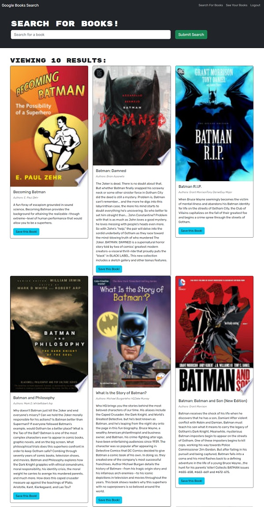

# BOOK SEARCH ENGINE

The project is a book tracking application built using React, Apollo Server, and MongoDB. Users can create an account, log in, and save their favorite books. The application utilizes GraphQL for data retrieval and mutations. It includes features such as user authentication, error handling, and secure access to protected routes. The SavedBooks component displays the user's saved books and allows for book deletion. The application provides a user-friendly interface for managing and viewing saved books.

[](https://opensource.org/licenses/MIT)

## Table of Contents

- [BOOK SEARCH ENGINE](#book-search-engine)
  - [Table of Contents](#table-of-contents)
  - [Installation](#installation)
  - [Usage](#usage)
  - [Website Link](#website-link)
  - [Website Screenshot](#website-screenshot)
  - [Github Repo](#github-repo)

## Installation

1. Clone the repository:

```
git clone https://github.com/arlindo2017/book-search-engine.git
```
2. Install the dependencies:
```
npm install
```
## Usage
1. Start the development server: 
```
npm start
```
2. Open your browser and visit http://localhost:3000 to view the application.

Technologies
- React
- GraphQL
- Apollo Client
- Bootstrap
- bcrypt
- Express
- Mongoose
- jsonwebtoken
- Apollo Server Express

## Website Link
https://book-search-engine-graphql.herokuapp.com/

## Website Screenshot

Google Movie Search Engine

 

## Github Repo
https://github.com/arlindo2017/book-search-engine

